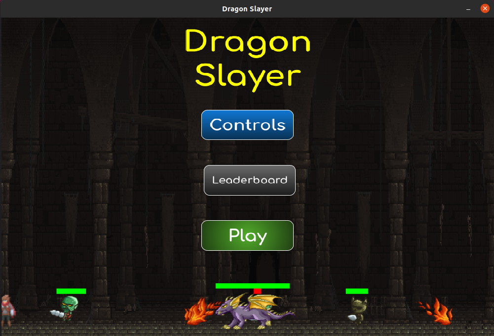
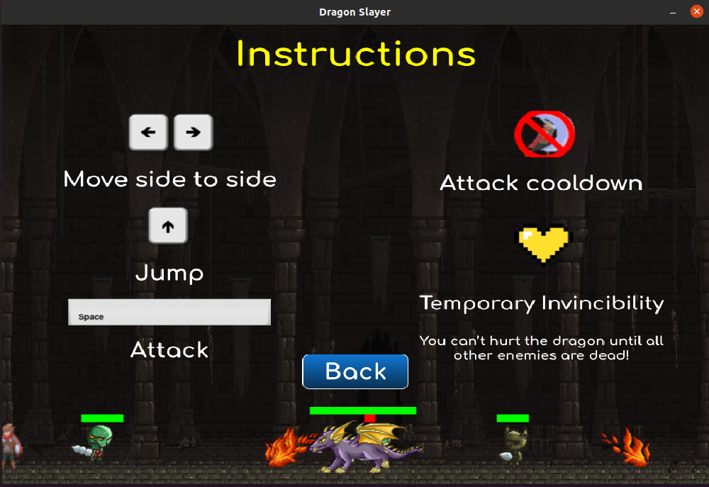
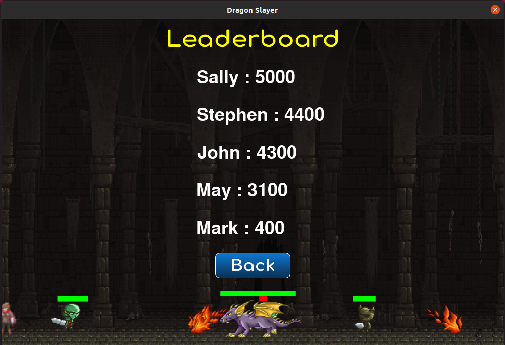
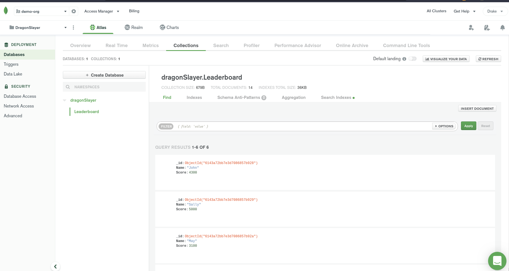

# Project 1 - Game Project

### I created a game called [Dragon Slayer](https://github.com/DrakeCullen/AdvPy-dpcullen/tree/main/dragon_slayer) using PyGame.

 

### Overview
My game satisfies all of the requirements and adds bells and whistles. Character and enemy sprites are generated by iterating through arrays, I implemented collision detection, the background color changes when you hurt an enemy or are hurt, icons are shown to indicate attack and damage cooldowns, music, and an external MongoDB database is used to keep track of the leaderboard.
 

### Installation Instructions
To install the game, clone this github repository. Next, run:
 

pip install pygame
 

pip install pymongo[srv]
 

Run the game by typing: ./main.py \[yourName].
"node main.js".
 

### Objective
In order to win, you must kill the dragon. Note, the dragon can't be injured until all enemies are destroyed. If you have extra lives when the game ends, you will be awarded bonus points!

 

Here is the main menu:
 

 

Here is the controls screen:
 

 

Here is the leaderboard that connects to MongoDB:
 

 

Here is the database:
 

 

Here is a gif of me losing:
 

 

Here is a gif of me winning:
 

 
