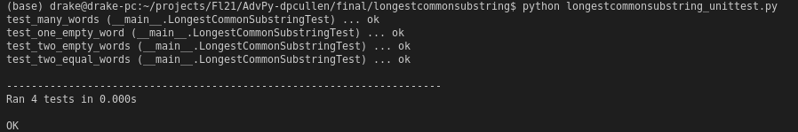
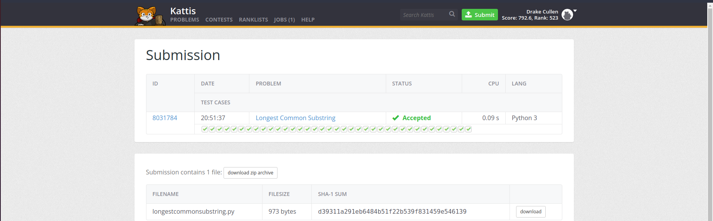
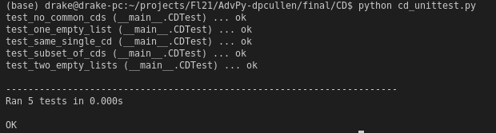
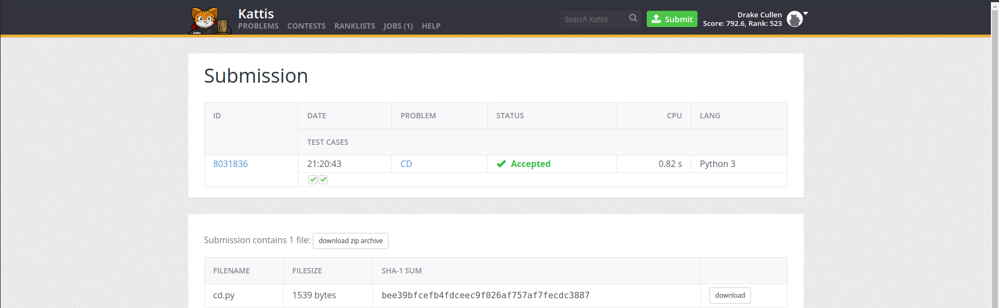
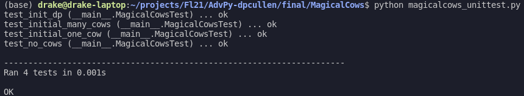
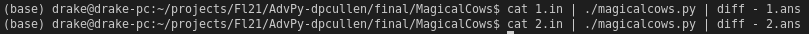

# Project 2 - Kattis Problems

### I choose problems with difficulties of 4.9, 4.6, and 4.4. Furthermore, each problem has at least 3 automated test cases and uses the unittest library. All the criteria is met, so I believe that I earn a score of 100%. Here are the links to the problems on Open Kattis: [Longest Common Substring](https://open.kattis.com/problems/longestcommonsubstring), [CD](https://open.kattis.com/problems/cd), and [Magical Cows](https://open.kattis.com/problems/magicalcows).

 

## Problem #1 - [Longest Common Substring](https://open.kattis.com/problems/longestcommonsubstring) (4.9 Difficulty)
 

 

 

 

## Problem #2 - [CD](https://open.kattis.com/problems/cd) (4.6 Difficulty)
 

 

 

 

## Problem #3 - [Magical Cows](https://open.kattis.com/problems/magicalcows) (4.4 Difficulty)
 

 

 

 