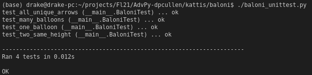
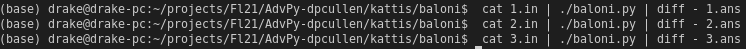
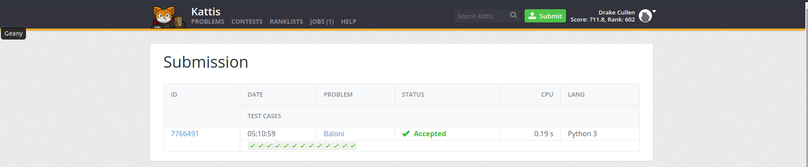
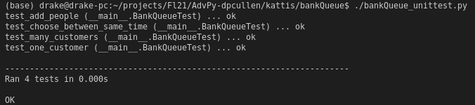
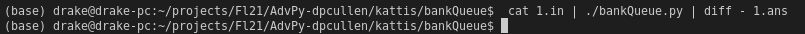
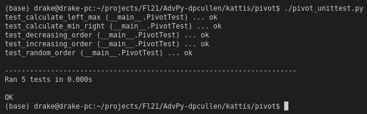
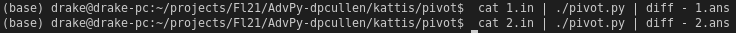

# Project 2 - Kattis Problems

### I choose problems with difficulties of 4.0, 3.7, and 3.2. Furthermore, each problem has at least 3 automated test cases and uses the unittest library. All the criteria is met, so I believe that I earn a score of 100%. Here are the links to the problems on Open Kattis: [Baloni](https://open.kattis.com/problems/baloni), [Bank Queue](https://open.kattis.com/problems/bank) and [Pivot](https://open.kattis.com/problems/pivot).

 

## Problem #1 - [Baloni](https://open.kattis.com/problems/baloni) (4.0 Difficulty)
 

 

 

 

## Problem #2 - [Bank Queue](https://open.kattis.com/problems/bank) (3.7 Difficulty)
 

 

 

 

## Problem #3 - [Pivot](https://open.kattis.com/problems/pivot) (3.2 Difficulty)
 

 

 

 